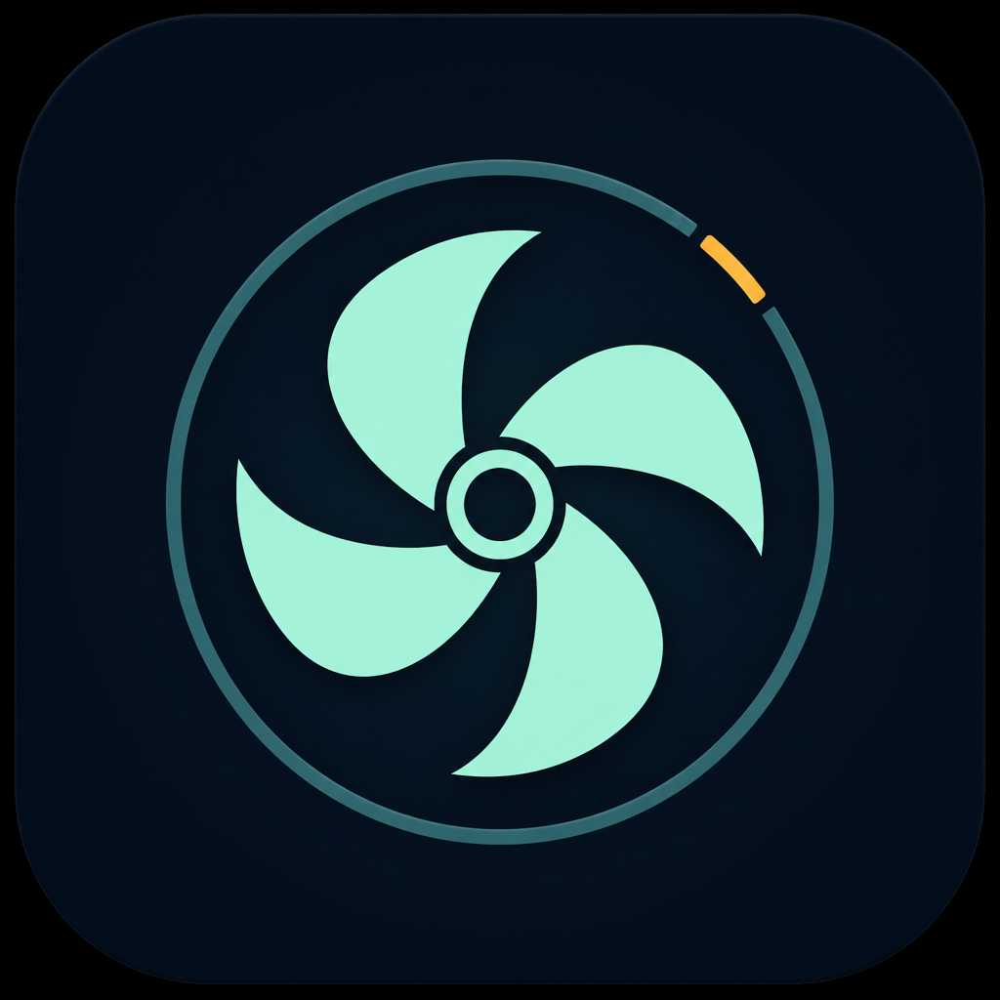
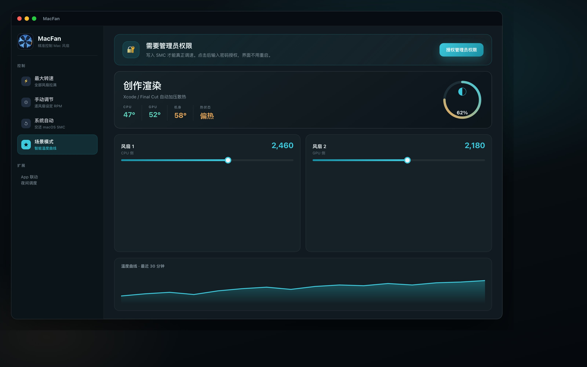
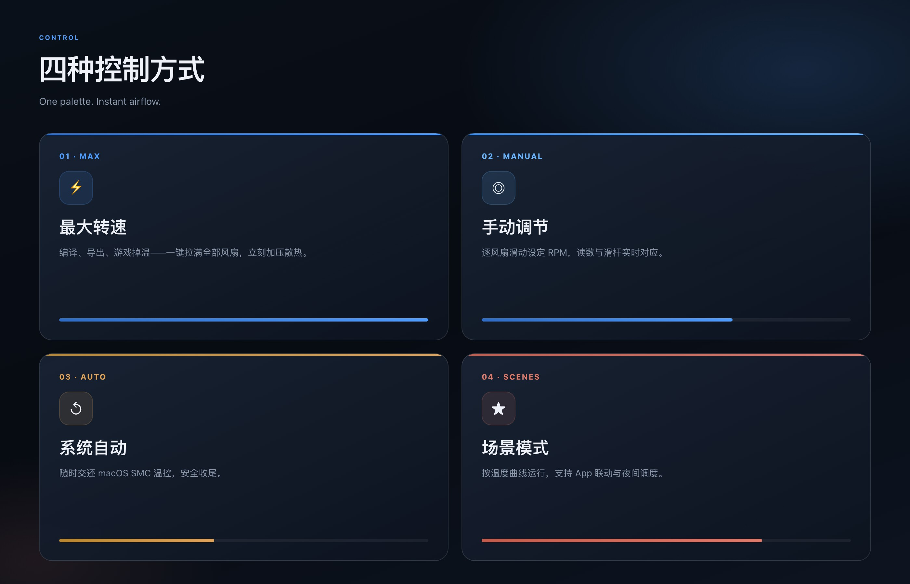
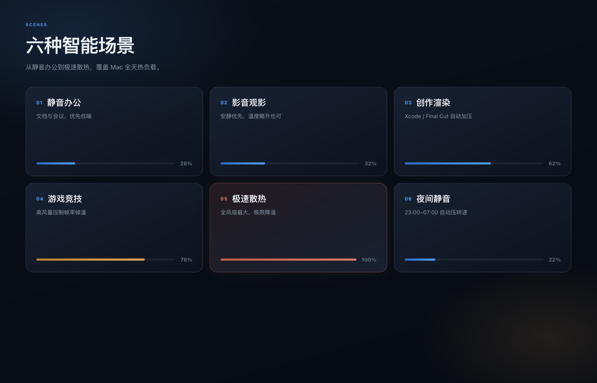
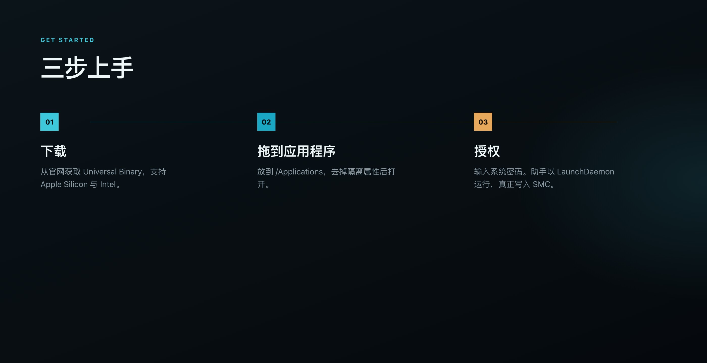

<p align="center">
  
</p>

<h1 align="center">MacFan</h1>

<p align="center">
  <b>精准控制 Mac 风扇转速</b><br />
  原生 SwiftUI · 实机读数 · 一键授权写入 SMC
</p>

<p align="center">
  <a href="./README.md">简体中文</a> ·
  <a href="./README.en.md">English</a>
</p>

<p align="center">
  
  
  
  
  
</p>

<p align="center">
  <a href="https://linux503.github.io/MacFan/assets/MacFan-1.1.7-macos.dmg"><b>下载 v1.1.7</b></a>
  ·
  <a href="https://linux503.github.io/MacFan/">官网</a>
  ·
  <a href="https://github.com/linux503/MacFan/releases/latest">Releases</a>
</p>

<p align="center">
  
</p>

<p align="center"><i>主界面：左侧切模式，右侧看温度、风扇与热轨迹。</i></p>

---

## 这是什么

MacFan 是给 **macOS 14+** 的原生风扇控制工具。它直接读写 SMC：能看到真实转速和温度，也能把目标 RPM 写回去。

支持 **Apple Silicon（M 系列）** 与 **Intel** Universal Binary。不要用 Xcode Debug 包去授权，请用[官网安装包](https://linux503.github.io/MacFan/assets/MacFan-1.1.7-macos.dmg)。

<table>
<tr>
<td width="50%">

<p align="center"><i>四种控制方式</i></p>
</td>
<td width="50%">

<p align="center"><i>六种开箱场景</i></p>
</td>
</tr>
</table>

---

## 功能

### 四种控制方式

| 模式 | 做什么 |
|------|--------|
| **最大转速** | 一键拉满全部风扇，编译 / 导出 / 掉温时用 |
| **手动调节** | 逐风扇滑动设定目标 RPM，读数与滑杆对应 |
| **系统自动** | 把温控交还 macOS SMC，长时间使用后请切回这里 |
| **场景模式** | 按温度曲线运行，可叠加 App 联动与夜间调度 |

### 六种场景

| 场景 | 说明 | 风量 |
|------|------|------|
| **静音办公** | 文档、会议，优先低噪 | 28% |
| **影音观影** | 安静优先，温度略升也可 | 32% |
| **创作渲染** | Xcode / Final Cut 等自动加压 | 62% |
| **游戏竞技** | 高风量压制掉温 | 78% |
| **极速散热** | 全风扇最大 | 100% |
| **夜间静音** | 23:00–07:00 自动压转速 | 22% |

### 一直能用到的能力

- **实机仪表**：CPU / GPU / 机身温度，以及每颗风扇当前 RPM
- **温度轨迹**：主面板历史曲线
- **应用联动**：前台 App 命中规则时自动切场景
- **夜间调度**：按时段压低转速
- **菜单栏常驻**：快捷切最大转速 / 系统自动 / 静音办公，并可退出
- **关窗口不退出**：关掉主窗口后仍留在菜单栏；要从菜单栏选「退出 MacFan」
- **中英双语**：App 内切换，**默认中文**（不跟随系统语言）
- **深色 / 浅色**：侧栏或 `⌘⇧L` 切浅色
- **检查更新**：读官网 `version.json`，失败时回退 GitHub Releases（`⌘U`）
- **打开官网**：侧栏、菜单栏或 `⌘0`

---

## 安装

<p align="center">
  
</p>

**要求：** macOS 14.0+ · 实机调速需要管理员权限（写入 SMC）

1. 下载 **[MacFan-1.1.7-macos.dmg](https://linux503.github.io/MacFan/assets/MacFan-1.1.7-macos.dmg)**
2. 打开磁盘映像，把 `MacFan.app` 拖进 **「应用程序」**
3. 若提示无法打开：右键图标 → **打开**
4. 打开后点 **「授权管理员权限」**，在系统密码框里输入密码  
   卡片上必须显示 **MacFan v1.1.7**

不要用 Xcode / DerivedData 里的 Debug 包授权。那个版本会走旧的安装路径，看起来像「授权成功但助手未就绪」。

---

## 使用

1. 先看侧栏授权卡片是否已是管理员状态。
2. 选一种控制模式，或进入场景模式挑一条曲线。
3. 手动模式下列表面板里的风扇滑杆即可。
4. 用完后切回 **系统自动**，把温控交还 macOS。
5. 关掉窗口后，点菜单栏风扇图标仍可调速或退出。

| 快捷键 | 作用 |
|--------|------|
| `⌘U` | 检查更新 |
| `⌘0` | 打开官网 |
| `⌘⇧L` | 浅色外观 |

---

## 权限说明

| 能力 | 管理员 |
|------|--------|
| 读取风扇转速 / 温度 | 通常不需要 |
| 写入目标转速 / 最大转速 | **需要**（root LaunchDaemon） |
| Apple Silicon（尤其 M3 / M4） | 可能需 `Ftst` 解锁，绕过 `thermalmonitord` |

助手以 LaunchDaemon 安装：

- plist：`/Library/LaunchDaemons/com.macfan.smchelper.plist`
- socket：`/tmp/macfan-smc.sock`

退出 App **不会**关掉助手，下次打开不必重新授权。长时间手动控温后，请切回系统自动。

---

## 常见问题

<details>
<summary><b>授权成功但助手未就绪</b></summary>

<br />

多半在跑 Xcode Debug 或旧安装包。请：

1. 菜单栏选「退出 MacFan」，确认活动监视器里没有 MacFan
2. 从官网下载 v1.1.7，拖进「应用程序」
3. 确认卡片写的是 **MacFan v1.1.7**，再授权
</details>

<details>
<summary><b>提示无法打开 / 已损坏</b></summary>

<br />

右键图标 → 打开。仍不行时在终端执行：

```bash
xattr -cr /Applications/MacFan.app
```
</details>

<details>
<summary><b>关掉窗口后程序还在</b></summary>

<br />

这是预期行为：MacFan 常驻菜单栏。点菜单栏图标 → **退出 MacFan**。
</details>

<details>
<summary><b>M 系列机型转速马上被拉回去</b></summary>

<br />

`thermalmonitord` 可能覆盖用户写入。MacFan 会尝试 `Ftst` 解锁。仍被拉回时，先切系统自动再重试最大转速。
</details>

---

## 从源码构建

```bash
git clone https://github.com/linux503/MacFan.git
cd MacFan
open MacFan.xcodeproj
```

选 **My Mac** → Product → Clean Build Folder → ⌘R。  
窗口里必须是 **v1.1.7**。

```bash
xcodebuild -scheme MacFan -configuration Release -destination 'platform=macOS' build
```

更完整的约定见 [贡献指南](CONTRIBUTING.md)。

---

## 架构

```
MacFan/
├── MacFan/                 # SwiftUI App
│   ├── Models/             # 场景、风扇、温度
│   ├── Services/           # SMC 客户端、助手、ViewModel、更新
│   ├── SMC/                # AppleSMC C 桥接
│   └── Views/              # 侧栏、仪表盘、菜单栏、主题
├── docs/                   # 官网（GitHub Pages）
└── MacFan.xcodeproj
```

- **UI**：SwiftUI + `MenuBarExtra`
- **硬件**：`AdaptiveFanController` + `SMCClient`（Intel / Apple Silicon）
- **写转速**：LaunchDaemon → Unix socket `/tmp/macfan-smc.sock`
- **架构**：`arm64` + `x86_64` Universal

本地预览官网：`open docs/index.html`

---

## 更新记录

<details>
<summary><b>1.1.7</b> — 新 Logo，菜单栏可退出，下拉更紧凑</summary>

- 程序坞 / 菜单栏 / 官网 / GitHub 使用同一套标志
- 菜单栏增加「退出 MacFan」
- 菜单栏下拉面板缩小
</details>

<details>
<summary><b>1.1.6</b> — LaunchDaemon 助手</summary>

- 管理员助手改为 LaunchDaemon（不再使用 nohup / python3 桩）
- 密码框在主线程弹出
- 退出 App 不再杀掉助手
</details>

---

## 路线图

- [ ] 签名 Privileged Helper（免每次输入密码）
- [ ] 自定义温度曲线编辑器
- [ ] 导出 / 导入场景配置
- [ ] Sparkle 自动更新

安全问题请看 [SECURITY.md](SECURITY.md)。

---

## License

[MIT](LICENSE) © 2026 MacFan
